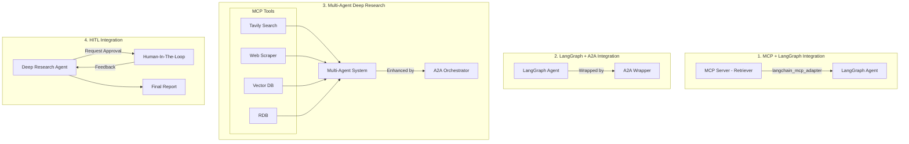
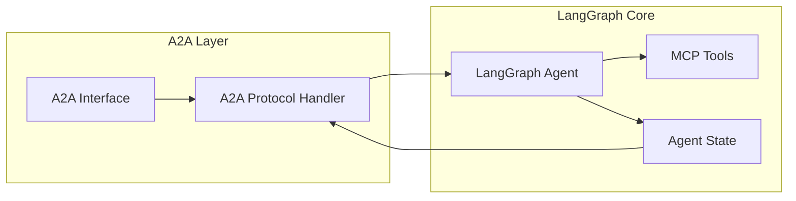
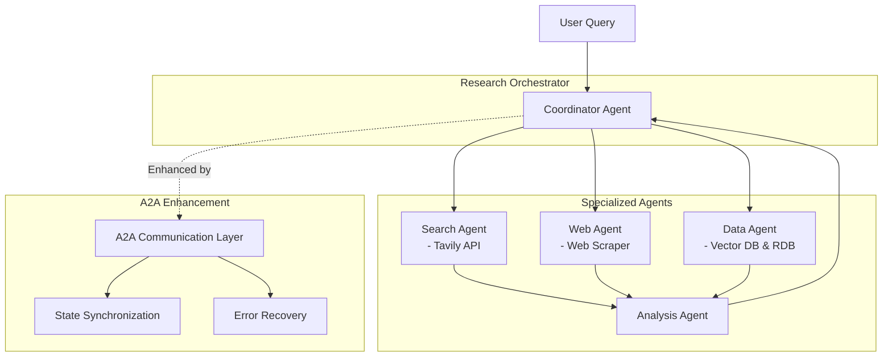
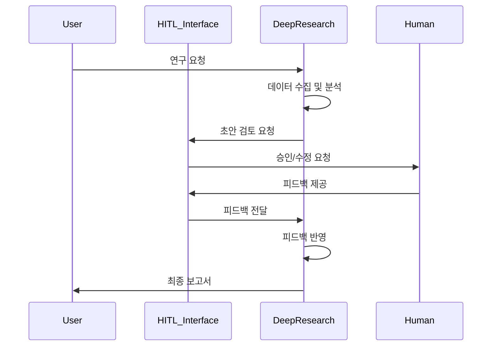

# MCP 와 A2A 로 개발하는 Multi Agent

FastCampus 온라인강의 [MCP 와 A2A 로 개발하는 Multi Agent](https://fastcampus.co.kr/data_online_mcpa2a) 실습 자료 1번

## 개발 환경 셋팅

1) Cursor
2) Shrimp-Task-Manager (MCP)
3) 참조문서에 대한 준비는 Repomix 로 미리 해둔 상태
(강의에 사용되는 패키지 버전과 문서 사용 버전이 상이할 시 **예상치 못한 오류 가능성** 있으니 주의)

- LangGraph 0.6.2
- FastMCP 2.10.6
- Langchain MCP Adapters 0.1.9
- a2a-sdk 0.3.0
- Google ADK 1.9.0

## 개발 시 주요 참고 문서 위치

- [LangChain-llms.txt](/docs/langchain-llms.txt)
- [LangGraph-llms-full.txt](/docs/langgraph-llms-full_0.6.2.txt)
- [LangGraph-llms.txt](/docs/langgraph-llms_0.6.2.txt)
- [FastMCP-llms.txt](/docs/fastmcp-llms_2.10.6.txt)
- [FastMCP-llms-full.txt](/docs/fastmcp-llms-full_2.10.6.txt)
- [a2a-python](/docs/a2a-python_0.3.0.txt)
- [a2a-samples](/docs/a2a-samples.txt)
- [Google ADK Python](/docs/adk-python_1.9.0.txt)

## 개발환경 셋팅(Package Manager `uv`)

Python 3.12 기반

```bash
uv init

uv venv

uv sync
```

---

## Architecture

### 전체 시스템 아키텍처



---

## 프로젝트 구현 단계

### 1단계: MCP Server를 LangGraph Agent의 도구로 통합하기

**Branch**: `feature/1.mcp-langgraph-integration`

#### 1-1. MCP Server 만들기: MCP for Retriever

```python
# MCP 서버 구조
mcp_retriever/
├── server.py          # FastMCP 기반 서버 구현
├── retriever.py       # 검색 로직 구현
└── config.py          # 설정 관리
```

**주요 기능**:

- 문서 검색 및 인덱싱
- 시맨틱 검색 지원
- 메타데이터 기반 필터링

#### 1-2. create_react_agent에 MCP Server 통합

```python
# 아주 단순한 Agent 구조
from langchain_openai import ChatOpenAI
from langgraph.prebuilt import create_react_agent

create_react_agent(
  model=ChatOpenAI(model="gpt-4.1"),
  tools=[],
  prompt="",
)
```

#### 1-3. Custom Prompt 구현

- 도구 사용 최적화
- Context-aware 응답 생성

**Expected Output**: MCP 도구를 활용하는 단일 LangGraph Agent

---

### 2단계: LangGraph Agent를 A2A로 통합하기

**Branch**: `feature/2.langgraph-a2a-integration`

#### 아키텍처 다이어그램



**구현 내용**:

- A2A Agent 클래스 생성
- LangGraph Agent를 A2A 스펙에 맞게 래핑
- 메시지 프로토콜 구현
- 상태 관리 및 동기화

---

### 3단계: MCP만으로 멀티에이전트 구현 후 A2A를 이용해 한계 극복하기

**Branch**: `feature/3.multi-agent-deep-research`

#### Deep Research 시스템 아키텍처



**프로젝트: Simple DeepResearch**

1. **MCP 기반 구현**:
   - 각 에이전트를 독립적인 MCP 서버로 구현
   - create_react_agent로 조정자 에이전트 생성
   - 도구 통합: Tavily, Web Scraper, Vector DB, RDB

2. **한계점**:
   - 에이전트 간 통신 복잡도
   - 상태 관리의 어려움
   - 에러 복구 메커니즘 부재

3. **A2A로 한계 극복**:
   - 표준화된 메시지 프로토콜
   - 자동 상태 동기화
   - 분산 에러 처리
   - 확장 가능한 아키텍처

**구현 구조**:

```python
deep_research/
├── agents/
│   ├── coordinator.py
│   ├── search_agent.py
│   ├── web_agent.py
│   ├── data_agent.py
│   └── analysis_agent.py
├── mcp_servers/
│   └── ... (각 도구별 MCP 서버)
└── a2a_wrapper/
    └── orchestrator.py
```

---

### 4단계: A2A 통신 과정에서 HITL(Human-In-The-Loop) 통해 사람의 판단을 요청하고나서 최종 응답을 받기

**Branch**: `feature/4.hitl-integration`

#### HITL 통합 아키텍처



**구현 내용**:

1. **HITL 통합 포인트**:
   - 최종 보고서 작성 전 검토
   - 중요 의사결정 시점
   - 데이터 검증 필요 시

2. **인터페이스 구현**:

3. **A2A 메시지 확장**:
   - HITL 요청 메시지 타입
   - 피드백 수신 프로토콜
   - 비동기 처리 메커니즘

**Expected Features**:

- 웹 기반 승인 인터페이스
- 모바일 알림 지원
- 타임아웃 및 대체 경로 설정
- 피드백 이력 관리

---

### Reference Docs

- [RepoMix](https://repomix.com/)
- [LangGraph-llms-full.txt](https://langchain-ai.github.io/langgraph/llms-full.txt)
- [LangChain-llms.txt](https://python.langchain.com/llms.txt)
- [LangChain-MCP-Adapter](https://github.com/langchain-ai/langchain-mcp-adapters)
- [FastMCP-llms-full.txt](https://gofastmcp.com/llms-full.txt)
- [Official-A2A-Python-SDK](https://github.com/a2aproject/a2a-python)
- [Official-A2A-Samples](https://github.com/a2aproject/a2a-samples)
