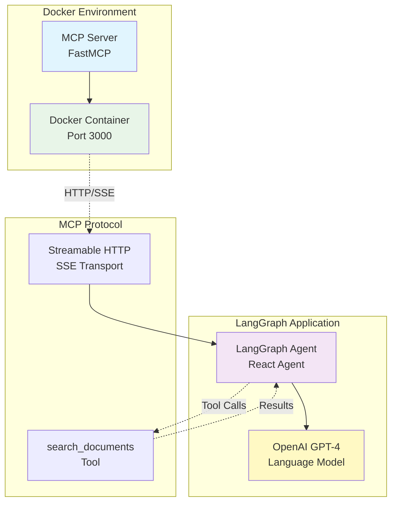

# 1단계: MCP Server를 LangGraph Agent의 도구로 통합

## 학습 목표

- FastMCP를 사용하여 간단한 MCP 서버 구현
- Docker 배포를 위한 Streamable HTTP 전송 방식 이해
- LangGraph Agent에서 MCP 도구 사용 방법 학습

## 전체 아키텍처



## 구현 단계별 계획

### Step 1.1: 기본 프로젝트 구조 설정

**목표**: 프로젝트 기본 구조 생성 및 환경 설정

**작업 내용**:

1. 디렉토리 구조 생성

   ```bash
   src/
   ├── mcp_retriever/
   │   ├── __init__.py
   │   ├── server.py
   │   └── retriever.py
   └── agents/
       ├── __init__.py
       └── simple_agent.py
   ```

2. 필수 패키지 설치
이미 완료되어 있음

3. 환경 변수 설정 (.env 파일)

```bash
OPENAI_API_KEY=your_api_key_here
```

**검증 기준**:

- 모든 패키지가 정상적으로 설치됨
- 디렉토리 구조가 올바르게 생성됨

### Step 1.2: 간단한 MCP 서버 구현

**목표**: FastMCP를 사용하여 기본 검색 도구를 제공하는 MCP 서버 구현

**작업 내용**:

1. `src/mcp_retriever/retriever.py` - 간단한 검색 로직 구현

```python
from pydantic import BaseModel, Field
from typing import List, Dict, Any

class Document(BaseModel):
    id: str = Field(..., description="문서 고유 식별자")
    title: str = Field(..., description="문서 제목")
    content: str = Field(..., description="문서 내용")
    metadata: Dict[str, Any] = Field(default_factory=dict, description="문서 메타데이터")

class InMemoryRetriever:
    def __init__(self):
        # 샘플 문서 데이터
        self.documents = [
            Document(
                id="1",
                title="FastMCP 소개",
                content="FastMCP는 Model Context Protocol을 쉽게 구현할 수 있는 Python 라이브러리입니다.",
                metadata={"category": "개발", "author": "FastMCP Team"}
            ),
            Document(
                id="2", 
                title="LangGraph 기본 가이드",
                content="LangGraph는 언어 모델을 사용한 상태 기반 애플리케이션을 구축하는 라이브러리입니다.",
                metadata={"category": "AI", "author": "LangChain Team"}
            ),
            # 더 많은 샘플 문서들...
        ]
    
    def search_documents(self, query: str) -> List[Dict[str, Any]]:
        """단순 키워드 매칭으로 문서 검색"""
        if not query:
            return []
        
        results = []
        for doc in self.documents:
            if query.lower() in doc.title.lower() or query.lower() in doc.content.lower():
                results.append({
                    "id": doc.id,
                    "title": doc.title,
                    "content": doc.content[:200] + "..." if len(doc.content) > 200 else doc.content,
                    "metadata": doc.metadata
                })
        
        return results
```

2. `src/mcp_retriever/server.py` - MCP 서버 구현

```python
import logging
from contextlib import asynccontextmanager
from collections.abc import AsyncIterator

from fastmcp import FastMCP
from starlette.applications import Starlette
from starlette.routing import Mount
import uvicorn

from .retriever import InMemoryRetriever

# 로깅 설정
logging.basicConfig(level=logging.INFO)
logger = logging.getLogger(__name__)

# MCP 서버 및 검색기 초기화
mcp = FastMCP("Document Retriever")
retriever = InMemoryRetriever()

@mcp.tool()
def search_documents(query: str) -> list[dict]:
    """문서 저장소에서 키워드로 검색합니다."""
    try:
        logger.info(f"Searching for: {query}")
        results = retriever.search_documents(query)
        logger.info(f"Found {len(results)} results")
        return results
    except Exception as e:
        logger.error(f"Search error: {e}")
        return {"error": str(e)}

@asynccontextmanager
async def lifespan(app: Starlette) -> AsyncIterator[None]:
    """애플리케이션 라이프사이클 관리"""
    logger.info("MCP Document Retriever Server starting...")
    try:
        yield
    finally:
        logger.info("MCP Document Retriever Server shutting down...")

def create_app() -> Starlette:
    """Streamable HTTP용 Starlette 앱 생성"""
    # Streamable HTTP 앱 생성 (stateless 모드)
    http_app = mcp.http_app(
        transport="streamable-http",
        json_response=False,  # SSE 스트림 사용
        stateless_http=True   # Docker 배포를 위한 stateless 모드
    )
    
    # 메인 애플리케이션 생성
    app = Starlette(
        debug=True,
        routes=[
            Mount("/mcp", app=http_app),
        ],
        lifespan=lifespan,
    )
    
    return app

def main():
    """서버 실행"""
    app = create_app()
    uvicorn.run(
        app,
        host="0.0.0.0",
        port=3000,
        log_level="info"
    )

if __name__ == "__main__":
    main()
```

**핵심 기능**:

- `search_documents(query: str)` 도구 제공 - FastMCP `@mcp.tool()` 데코레이터 사용
- 메모리 기반 문서 저장소 (5-10개 샘플 데이터 포함)
- Streamable HTTP 전송 (STDIO 금지) - `transport="streamable-http"` 설정
- Stateless 모드 - Docker 멀티 인스턴스 배포 지원
- 구조화된 로깅 - 디버깅 및 모니터링용

**검증 기준**:

- 서버가 포트 3000에서 정상적으로 시작됨
- `http://localhost:3000/mcp` 엔드포인트가 MCP 프로토콜 요청에 응답함
- 로그에 시작/종료 메시지가 출력됨

### Step 1.3: Docker 설정

**목표**: MCP 서버를 Docker 컨테이너로 패키징

**작업 내용**:

1. `Dockerfile` 작성

```dockerfile
# Python 3.12 slim 베이스 이미지 사용
FROM python:3.12-slim

# 작업 디렉토리 설정
WORKDIR /app

# 시스템 패키지 업데이트 및 필요한 도구 설치
RUN apt-get update && apt-get install -y \
    curl \
    && rm -rf /var/lib/apt/lists/*

# UV 패키지 매니저 설치
RUN pip install uv

# 프로젝트 파일 복사
COPY pyproject.toml uv.lock ./
COPY src/ ./src/

# 의존성 설치 (UV 사용)
RUN uv sync --frozen

# 헬스체크 엔드포인트 추가
HEALTHCHECK --interval=30s --timeout=10s --start-period=5s --retries=3 \
    CMD curl -f http://localhost:3000/mcp/health || exit 1

# HTTP 포트 노출
EXPOSE 3000

# 환경변수 설정
ENV PYTHONPATH=/app
ENV HOST=0.0.0.0
ENV PORT=3000

# 애플리케이션 실행
CMD ["uv", "run", "python", "-m", "src.mcp_retriever.server"]
```

2. `docker-compose.yml` 작성

```yaml
version: '3.8'

services:
  mcp-retriever:
    build: .
    ports:
      - "3000:3000"
    environment:
      - LOG_LEVEL=info
      - HOST=0.0.0.0
      - PORT=3000
    volumes:
      # 로그 파일 저장용 (선택사항)
      - ./logs:/app/logs
    restart: unless-stopped
    healthcheck:
      test: ["CMD", "curl", "-f", "http://localhost:3000/mcp/health"]
      interval: 30s
      timeout: 10s
      retries: 3
      start_period: 40s

networks:
  default:
    name: mcp-network
```

3. `.dockerignore` 작성

```dockerignore
# Python
__pycache__/
*.pyc
*.pyo
*.pyd
.Python
*.so
.coverage
.pytest_cache/

# Virtual environments
.env
.venv
env/
venv/

# IDE
.vscode/
.idea/
*.swp
*.swo

# Git
.git/
.gitignore

# Docker
Dockerfile
docker-compose.yml
.dockerignore

# Documentation
README.md
docs/
*.md

# Logs
logs/
*.log
```

4. 개발용 스크립트 추가 (`scripts/docker-dev.sh`)

```bash
#!/bin/bash
# Docker 개발 환경 스크립트

set -e

echo "🐳 Building MCP Retriever Docker image..."
docker-compose build

echo "🚀 Starting MCP Retriever service..."
docker-compose up -d

echo "⏰ Waiting for service to be ready..."
sleep 10

echo "🧪 Testing MCP endpoint..."
curl -X POST http://localhost:3000/mcp/test || echo "Service not ready yet"

echo "📊 Service status:"
docker-compose ps

echo "📝 Logs:"
docker-compose logs --tail=20 mcp-retriever

echo "✅ MCP Retriever is running at http://localhost:3000/mcp"
```

**핵심 기능**:

- **경량화된 이미지**: Python 3.12 slim 기반으로 최적화
- **UV 패키지 매니저**: 빠른 의존성 설치 및 관리
- **헬스체크**: 컨테이너 상태 자동 모니터링
- **로깅**: 구조화된 로그 출력 및 볼륨 마운트
- **개발 편의성**: 개발용 스크립트 제공

**검증 기준**:

- `docker-compose build` 명령으로 이미지가 성공적으로 빌드됨
- `docker-compose up -d` 명령으로 컨테이너가 정상 실행됨
- `http://localhost:3000/mcp` 엔드포인트가 정상 응답함
- 헬스체크가 healthy 상태를 유지함
- 로그에서 서버 시작 메시지 확인 가능함

### Step 1.4: LangGraph Agent 구현

**목표**: MCP 도구를 사용하는 간단한 React Agent 구현

**작업 내용**:

1. `src/agents/simple_mcp_agent.py` - React Agent with MCP Tool 구현

```python
import os
import asyncio
import logging
from typing import Dict, Any

from langchain_openai import ChatOpenAI
from langchain_core.messages import HumanMessage
from langgraph.prebuilt import create_react_agent

from langchain_mcp_adapters.client import MultiServerMCPClient

# 로깅 설정
logging.basicConfig(level=logging.INFO)
logger = logging.getLogger(__name__)

class MCPDocumentAgent:
    """MCP 도구를 사용하는 문서 검색 에이전트"""
    
    def __init__(self, openai_api_key: str = None, mcp_server_url: str = "http://localhost:3000/mcp"):
        """
        Args:
            openai_api_key: OpenAI API 키 (환경변수 OPENAI_API_KEY에서 가져올 수 있음)
            mcp_server_url: MCP 서버 URL
        """
        # OpenAI API 키 설정
        if not openai_api_key:
            openai_api_key = os.getenv("OPENAI_API_KEY")
        if not openai_api_key:
            raise ValueError("OPENAI_API_KEY가 필요합니다")
        
        # LLM 초기화 - GPT-4 사용
        self.llm = ChatOpenAI(
            model="gpt-4",
            temperature=0,
            api_key=openai_api_key
        )
        
        # MCP 클라이언트 설정
        self.mcp_client = MultiServerMCPClient({
            "document_retriever": {
                "transport": "streamable_http",
                "url": mcp_server_url,
                # 헤더 설정 (필요시)
                "headers": {
                    "User-Agent": "LangGraph-MCP-Agent/1.0"
                },
                # 타임아웃 설정
                "timeout": 30,
                "sse_read_timeout": 60
            }
        })
        
        self.agent = None
        self.tools = None
    
    async def initialize(self):
        """에이전트 초기화 - MCP 도구 로드"""
        try:
            logger.info("MCP 도구 로드 중...")
            # MCP 서버에서 도구 로드
            self.tools = await self.mcp_client.get_tools()
            logger.info(f"로드된 도구 수: {len(self.tools)}")
            
            # 도구 정보 출력
            for tool in self.tools:
                logger.info(f"도구: {tool.name} - {tool.description}")
            
            # React Agent 생성
            self.agent = create_react_agent(
                self.llm, 
                self.tools,
                # 시스템 메시지 커스터마이징
                system_message=(
                    "당신은 문서 검색 전문 AI 어시스턴트입니다. "
                    "사용자의 질문에 답하기 위해 search_documents 도구를 사용하여 "
                    "관련 문서를 찾고, 그 내용을 바탕으로 정확하고 도움이 되는 답변을 제공하세요. "
                    "검색 결과가 없으면 솔직히 모른다고 답하세요."
                )
            )
            
            logger.info("Agent 초기화 완료")
            
        except Exception as e:
            logger.error(f"Agent 초기화 실패: {e}")
            raise
    
    async def query(self, user_message: str) -> Dict[str, Any]:
        """사용자 질의 처리"""
        if not self.agent:
            raise RuntimeError("Agent가 초기화되지 않았습니다. initialize()를 먼저 호출하세요.")
        
        try:
            logger.info(f"사용자 질의: {user_message}")
            
            # Agent 실행
            response = await self.agent.ainvoke({
                "messages": [HumanMessage(content=user_message)]
            })
            
            # 응답 구조화
            result = {
                "user_query": user_message,
                "agent_response": response["messages"][-1].content,
                "tool_calls": [],
                "success": True
            }
            
            # 도구 호출 정보 추출
            for message in response["messages"]:
                if hasattr(message, 'tool_calls') and message.tool_calls:
                    for tool_call in message.tool_calls:
                        result["tool_calls"].append({
                            "tool": tool_call["name"],
                            "args": tool_call["args"]
                        })
            
            logger.info(f"응답 생성 완료: {len(result['agent_response'])} 문자")
            return result
            
        except Exception as e:
            logger.error(f"질의 처리 실패: {e}")
            return {
                "user_query": user_message,
                "agent_response": f"죄송합니다. 질의 처리 중 오류가 발생했습니다: {str(e)}",
                "tool_calls": [],
                "success": False,
                "error": str(e)
            }

async def main():
    """테스트 실행"""
    try:
        # Agent 생성 및 초기화
        agent = MCPDocumentAgent()
        await agent.initialize()
        
        # 테스트 질의들
        test_queries = [
            "FastMCP에 대해 알려주세요",
            "LangGraph는 무엇인가요?",
            "AI와 개발 관련 문서가 있나요?",
            "Python 관련 정보를 찾아주세요"  # 검색 결과가 없는 경우 테스트
        ]
        
        for query in test_queries:
            print(f"\n{'='*50}")
            print(f"질의: {query}")
            print('='*50)
            
            result = await agent.query(query)
            print(f"응답: {result['agent_response']}")
            
            if result['tool_calls']:
                print(f"사용된 도구: {result['tool_calls']}")
            
            if not result['success']:
                print(f"오류: {result.get('error', 'Unknown error')}")
    
    except Exception as e:
        print(f"실행 오류: {e}")

if __name__ == "__main__":
    asyncio.run(main())
```

2. 환경 설정 파일 (`.env.example`) 업데이트

```bash
# OpenAI API 키
OPENAI_API_KEY=your_openai_api_key_here

# MCP 서버 설정
MCP_SERVER_URL=http://localhost:3000/mcp

# 로깅 레벨
LOG_LEVEL=INFO
```

**핵심 기능**:

- **MultiServerMCPClient**: Streamable HTTP 전송으로 MCP 서버 연결
- **create_react_agent**: LangGraph의 사전 구축된 React Agent 패턴 사용
- **도구 자동 로드**: MCP 서버에서 사용 가능한 모든 도구 자동 검색
- **구조화된 응답**: 사용자 질의, 에이전트 응답, 도구 호출 정보 포함
- **에러 처리**: 연결 실패, 도구 호출 실패 등 다양한 오류 상황 처리
- **로깅**: 상세한 로그로 디버깅 및 모니터링 지원

**검증 기준**:

- Agent가 MCP 서버에 성공적으로 연결됨
- `search_documents` 도구가 정상적으로 로드됨
- 검색 질의에 대해 관련 문서를 찾아 응답 생성함
- 검색 결과가 없는 경우 적절히 처리함
- 오류 발생 시 명확한 에러 메시지 제공함

### Step 1.5: 통합 테스트 및 예제

**목표**: 전체 시스템 통합 테스트 및 사용 예제 작성

**작업 내용**:

1. `examples/basic_search.py` - 기본 검색 예제

```python
"""
기본 MCP + LangGraph 통합 예제
MCP 서버가 실행 중이어야 함 (docker-compose up -d)
"""
import asyncio
import os
from src.agents.simple_mcp_agent import MCPDocumentAgent

async def run_basic_search_demo():
    """기본 검색 데모 실행"""
    print("🚀 MCP + LangGraph 통합 데모 시작")
    print("=" * 60)
    
    # 환경 확인
    if not os.getenv("OPENAI_API_KEY"):
        print("❌ OPENAI_API_KEY 환경변수가 설정되지 않았습니다.")
        print("   .env 파일을 생성하거나 환경변수를 설정해주세요.")
        return
    
    try:
        # Agent 초기화
        print("🔧 Agent 초기화 중...")
        agent = MCPDocumentAgent()
        await agent.initialize()
        print("✅ Agent 초기화 완료")
        
        # 검색 시나리오들
        search_scenarios = [
            {
                "title": "FastMCP 정보 검색",
                "query": "FastMCP에 대해 자세히 알려주세요",
                "expected": "FastMCP 라이브러리에 대한 설명"
            },
            {
                "title": "LangGraph 정보 검색", 
                "query": "LangGraph는 무엇이고 어떻게 사용하나요?",
                "expected": "LangGraph 라이브러리 사용법"
            },
            {
                "title": "개발 도구 검색",
                "query": "AI 개발에 도움이 되는 도구들을 추천해주세요",
                "expected": "AI 개발 관련 도구 추천"
            },
            {
                "title": "없는 정보 검색 (오류 처리 테스트)",
                "query": "Java Spring Framework에 대해 알려주세요",
                "expected": "검색 결과 없음 또는 관련 정보 없음"
            }
        ]
        
        # 각 시나리오 실행
        for i, scenario in enumerate(search_scenarios, 1):
            print(f"\n📍 시나리오 {i}: {scenario['title']}")
            print("-" * 40)
            print(f"질의: {scenario['query']}")
            print(f"예상: {scenario['expected']}")
            print()
            
            # Agent 실행
            result = await agent.query(scenario['query'])
            
            # 결과 출력
            print("📋 응답:")
            print(result['agent_response'])
            
            if result['tool_calls']:
                print(f"\n🔧 사용된 도구: {[call['tool'] for call in result['tool_calls']]}")
            
            if not result['success']:
                print(f"❌ 오류: {result.get('error', 'Unknown error')}")
            
            print("\n" + "="*60)
        
        print("\n🎉 모든 시나리오 완료!")
        
    except Exception as e:
        print(f"❌ 데모 실행 실패: {e}")
        print("\n💡 문제 해결 방법:")
        print("1. MCP 서버가 실행 중인지 확인: docker-compose ps")
        print("2. MCP 서버에 접근 가능한지 확인: curl http://localhost:3000/mcp/health")
        print("3. OPENAI_API_KEY가 올바르게 설정되었는지 확인")

if __name__ == "__main__":
    asyncio.run(run_basic_search_demo())
```

2. `tests/integration_test.py` - 통합 테스트

```python
"""
MCP + LangGraph 통합 테스트
pytest로 실행: pytest tests/integration_test.py -v
"""
import pytest
import asyncio
import os
import httpx
from unittest.mock import AsyncMock, patch

from src.agents.simple_mcp_agent import MCPDocumentAgent
from langchain_mcp_adapters.client import MultiServerMCPClient

class TestMCPIntegration:
    """MCP 통합 테스트"""
    
    @pytest.fixture
    def mock_openai_key(self, monkeypatch):
        """OpenAI API 키 모킹"""
        monkeypatch.setenv("OPENAI_API_KEY", "test-key-123")
    
    @pytest.mark.asyncio
    async def test_mcp_server_health_check(self):
        """MCP 서버 헬스체크 테스트"""
        try:
            async with httpx.AsyncClient() as client:
                response = await client.get("http://localhost:3000/mcp/health", timeout=5.0)
                assert response.status_code == 200, "MCP 서버가 응답하지 않습니다"
        except httpx.ConnectError:
            pytest.skip("MCP 서버가 실행되지 않았습니다. docker-compose up -d로 서버를 시작하세요.")
    
    @pytest.mark.asyncio 
    async def test_mcp_client_connection(self):
        """MCP 클라이언트 연결 테스트"""
        client = MultiServerMCPClient({
            "test_server": {
                "transport": "streamable_http",
                "url": "http://localhost:3000/mcp"
            }
        })
        
        try:
            # 도구 목록 가져오기 테스트
            tools = await client.get_tools(server_name="test_server")
            assert len(tools) > 0, "MCP 서버에서 도구를 로드할 수 없습니다"
            
            # search_documents 도구 확인
            tool_names = [tool.name for tool in tools]
            assert "search_documents" in tool_names, "search_documents 도구가 없습니다"
            
        except Exception as e:
            pytest.fail(f"MCP 클라이언트 연결 실패: {e}")
    
    @pytest.mark.asyncio
    async def test_search_tool_execution(self):
        """검색 도구 직접 실행 테스트"""
        client = MultiServerMCPClient({
            "test_server": {
                "transport": "streamable_http", 
                "url": "http://localhost:3000/mcp"
            }
        })
        
        try:
            tools = await client.get_tools(server_name="test_server")
            search_tool = next((tool for tool in tools if tool.name == "search_documents"), None)
            assert search_tool is not None, "search_documents 도구를 찾을 수 없습니다"
            
            # 도구 실행
            result = await search_tool.ainvoke({"query": "FastMCP"})
            assert result is not None, "검색 결과가 None입니다"
            assert isinstance(result, (list, dict)), "검색 결과 형식이 올바르지 않습니다"
            
        except Exception as e:
            pytest.fail(f"검색 도구 실행 실패: {e}")
    
    @pytest.mark.asyncio
    @patch('langchain_openai.ChatOpenAI')
    async def test_agent_initialization(self, mock_llm, mock_openai_key):
        """Agent 초기화 테스트"""
        # LLM 모킹
        mock_llm_instance = AsyncMock()
        mock_llm.return_value = mock_llm_instance
        
        try:
            agent = MCPDocumentAgent()
            await agent.initialize()
            
            assert agent.tools is not None, "도구가 로드되지 않았습니다"
            assert len(agent.tools) > 0, "도구 목록이 비어있습니다"
            assert agent.agent is not None, "Agent가 생성되지 않았습니다"
            
        except Exception as e:
            if "MCP 서버" in str(e) or "연결" in str(e):
                pytest.skip("MCP 서버 연결 실패. 서버가 실행 중인지 확인하세요.")
            else:
                pytest.fail(f"Agent 초기화 실패: {e}")
    
    @pytest.mark.asyncio 
    @patch('langchain_openai.ChatOpenAI')
    async def test_agent_query_handling(self, mock_llm, mock_openai_key):
        """Agent 질의 처리 테스트"""
        # LLM 응답 모킹
        mock_llm_instance = AsyncMock()
        mock_response = {
            "messages": [
                AsyncMock(content="FastMCP는 Model Context Protocol을 쉽게 구현할 수 있는 라이브러리입니다.")
            ]
        }
        mock_llm_instance.bind_tools.return_value.ainvoke.return_value = mock_response
        mock_llm.return_value = mock_llm_instance
        
        # create_react_agent 모킹
        with patch('src.agents.simple_mcp_agent.create_react_agent') as mock_create_agent:
            mock_agent = AsyncMock()
            mock_agent.ainvoke.return_value = mock_response
            mock_create_agent.return_value = mock_agent
            
            try:
                agent = MCPDocumentAgent()
                await agent.initialize()
                
                result = await agent.query("FastMCP에 대해 알려주세요")
                
                assert result['success'] == True, "질의 처리가 실패했습니다"
                assert result['user_query'] == "FastMCP에 대해 알려주세요"
                assert len(result['agent_response']) > 0, "응답이 비어있습니다"
                
            except Exception as e:
                if "MCP 서버" in str(e):
                    pytest.skip("MCP 서버 연결 실패")
                else:
                    pytest.fail(f"Agent 질의 처리 실패: {e}")

# 테스트 실행을 위한 헬퍼 함수
def run_integration_tests():
    """통합 테스트 실행"""
    print("🧪 MCP + LangGraph 통합 테스트 시작")
    print("=" * 50)
    
    # pytest 실행
    exit_code = pytest.main([
        "tests/integration_test.py",
        "-v",
        "--tb=short",
        "--color=yes"
    ])
    
    if exit_code == 0:
        print("\n✅ 모든 테스트 통과!")
    else:
        print(f"\n❌ 테스트 실패 (종료 코드: {exit_code})")
    
    return exit_code

if __name__ == "__main__":
    run_integration_tests()
```

3. `scripts/test-all.sh` - 전체 테스트 실행 스크립트

```bash
#!/bin/bash
# 전체 시스템 테스트 스크립트

set -e

echo "🏁 MCP + LangGraph 통합 시스템 테스트 시작"
echo "=" * 60

# 1. 환경 변수 확인
echo "🔍 1. 환경 설정 확인..."
if [ -z "$OPENAI_API_KEY" ]; then
    echo "❌ OPENAI_API_KEY가 설정되지 않았습니다."
    echo "   .env 파일을 만들거나 환경변수를 설정해주세요."
    exit 1
fi
echo "✅ 환경 변수 확인 완료"

# 2. MCP 서버 시작
echo -e "\n🐳 2. MCP 서버 시작..."
docker-compose up -d
sleep 15  # 서버 시작 대기

# 3. 서버 헬스체크
echo -e "\n🏥 3. 서버 헬스체크..."
for i in {1..5}; do
    if curl -f http://localhost:3000/mcp/health > /dev/null 2>&1; then
        echo "✅ MCP 서버 정상 동작"
        break
    else
        echo "⏳ 서버 시작 대기 중... ($i/5)"
        sleep 5
    fi
    
    if [ $i -eq 5 ]; then
        echo "❌ MCP 서버 시작 실패"
        docker-compose logs mcp-retriever
        exit 1
    fi
done

# 4. 통합 테스트 실행
echo -e "\n🧪 4. 통합 테스트 실행..."
python -m pytest tests/integration_test.py -v

# 5. 기본 예제 실행
echo -e "\n📝 5. 기본 예제 실행..."
python examples/basic_search.py

# 6. 정리
echo -e "\n🧹 6. 정리..."
docker-compose logs --tail=20 mcp-retriever
echo -e "\n💡 서버를 종료하려면: docker-compose down"

echo -e "\n🎉 모든 테스트 완료!"
```

**핵심 기능**:

- **통합 테스트**: MCP 서버 연결, 도구 로드, Agent 실행까지 전체 파이프라인 테스트
- **모킹 지원**: OpenAI API 키 없이도 테스트 가능한 모킹 시스템
- **자동화 스크립트**: Docker 시작부터 테스트 실행까지 자동화
- **에러 시나리오**: 연결 실패, 도구 호출 실패 등 다양한 오류 상황 테스트
- **실용적 예제**: 실제 사용 시나리오를 반영한 예제 코드

**검증 기준**:

- MCP 서버 헬스체크 통과 (`http://localhost:3000/mcp/health`)
- 모든 pytest 테스트 통과 (연결, 도구 로드, Agent 실행)
- 기본 예제 스크립트가 오류 없이 실행됨
- 다양한 검색 시나리오에서 적절한 응답 생성됨
- 오류 상황에서 명확한 에러 메시지 출력됨

## 예상 문제점 및 해결 방안

### 1. Docker 네트워킹 이슈

**문제**: 컨테이너 간 통신 문제 또는 localhost 접근 실패
**해결**:

- `docker-compose.yml`의 네트워크 설정 확인
- Host에서 접근 시 `localhost:3000/mcp` 사용
- 컨테이너 내부에서는 서비스명 사용

### 2. Streamable HTTP 연결 실패

**문제**: `Connection refused` 또는 `Timeout` 에러
**해결**:

```bash
# 서버 상태 확인
docker-compose ps
docker-compose logs mcp-retriever

# 헬스체크 확인  
curl -v http://localhost:3000/mcp/health

# 포트 확인
netstat -tulpn | grep 3000
```

### 3. MCP 도구 로드 실패

**문제**: `No tools found` 또는 `Tool not available` 에러
**해결**:

- FastMCP 서버의 `@mcp.tool()` 데코레이터 확인
- MCP 서버 로그에서 도구 등록 메시지 확인
- `langchain-mcp-adapters` 버전 호환성 확인 (0.1.9)

### 4. OpenAI API 키 관련 문제

**문제**: `Authentication failed` 또는 `API key not found`
**해결**:

```bash
# 환경변수 확인
echo $OPENAI_API_KEY

# .env 파일 생성
cat > .env << EOF
OPENAI_API_KEY=your_actual_api_key_here
EOF

# .env 파일 로드
source .env
```

### 5. FastMCP 서버 시작 실패

**문제**: `ModuleNotFoundError` 또는 `ImportError`
**해결**:

```bash
# 의존성 재설치
uv sync

# Python 경로 확인
export PYTHONPATH=/app:$PYTHONPATH

# 서버 직접 실행으로 디버깅
python -m src.mcp_retriever.server
```

### 6. LangGraph Agent 초기화 실패

**문제**: `Agent creation failed` 또는 `Tools binding error`
**해결**:

- MCP 서버 실행 상태 재확인
- `MultiServerMCPClient` 연결 설정 확인
- LangGraph 및 LangChain 버전 호환성 확인

## 학습 자료 준비

### 1. 개념 설명 자료

#### MCP (Model Context Protocol) 기본 개념

- **목적**: AI 애플리케이션과 데이터 소스 간의 표준화된 연결 프로토콜
- **구성 요소**: 서버(도구 제공자), 클라이언트(도구 사용자), 전송 레이어
- **장점**: 모듈화, 재사용성, 표준화된 인터페이스

#### FastMCP vs 일반 MCP 차이점

- **FastMCP**: Python 기반 고수준 프레임워크, 데코레이터 기반 간편한 도구 등록
- **일반 MCP**: 저수준 프로토콜, 수동 스키마 정의 필요
- **개발 속도**: FastMCP가 5-10배 빠른 개발 가능

#### Streamable HTTP 전송 방식

- **SSE (Server-Sent Events)**: 실시간 스트리밍 지원
- **Stateless 모드**: Docker 스케일링에 최적화
- **HTTP/1.1 호환**: 기존 인프라와 쉬운 통합

### 2. 핵심 코드 패턴

#### FastMCP 도구 등록 패턴

```python
@mcp.tool()
def my_tool(param: str) -> dict:
    """도구 설명 - LLM이 이해할 수 있게 명확히 작성"""
    return {"result": param}
```

#### LangGraph Agent 패턴

```python
# 1. MCP 클라이언트 설정
client = MultiServerMCPClient({
    "server_name": {
        "transport": "streamable_http",
        "url": "http://localhost:3000/mcp"
    }
})

# 2. 도구 로드
tools = await client.get_tools()

# 3. Agent 생성
agent = create_react_agent(llm, tools)
```

#### 에러 처리 패턴

```python
try:
    result = await agent.ainvoke({"messages": [message]})
except Exception as e:
    logger.error(f"Agent 실행 실패: {e}")
    return {"error": str(e), "success": False}
```

### 3. 실습 단계별 체크리스트

#### 환경 설정 체크리스트

- [ ] Python 3.12+ 설치 확인
- [ ] UV 패키지 매니저 설치
- [ ] Docker & Docker Compose 설치
- [ ] OpenAI API 키 준비
- [ ] 프로젝트 의존성 설치 (`uv sync`)

#### MCP 서버 구현 체크리스트

- [ ] FastMCP 서버 생성 (`FastMCP("server_name")`)
- [ ] 도구 함수 구현 및 `@mcp.tool()` 데코레이터 추가
- [ ] Streamable HTTP 전송 설정 (`transport="streamable-http"`)
- [ ] Docker 이미지 빌드 및 실행 테스트
- [ ] 헬스체크 엔드포인트 동작 확인

#### LangGraph Agent 구현 체크리스트

- [ ] `MultiServerMCPClient` 설정
- [ ] MCP 도구 로드 성공 확인
- [ ] `create_react_agent` 생성
- [ ] 테스트 질의 실행 및 응답 확인
- [ ] 에러 처리 및 로깅 구현

### 4. 자주 묻는 질문 (FAQ)

**Q: STDIO 전송 방식을 사용할 수 없나요?**
A: 이 과정에서는 Docker 배포를 목표로 하므로 Streamable HTTP만 사용합니다. STDIO는 로컬 프로세스 간 통신에만 적합합니다.

**Q: OpenAI 대신 다른 LLM을 사용할 수 있나요?**
A: 네. LangChain이 지원하는 모든 LLM을 사용할 수 있습니다 (Claude, Gemini 등). `ChatOpenAI` 대신 해당 LLM 클래스를 사용하면 됩니다.

**⚠️ Gemini 사용 시 주의사항:** Gemini는 Tool calling에서 일관성 이슈가 발생할 수 있습니다. 다음 사항을 유의하세요:

- **프롬프트 정밀도**: 시스템 메시지에서 도구 사용 방법을 구체적으로 명시
- **도구 설명 상세화**: `@mcp.tool()` 함수의 docstring을 매우 구체적으로 작성
- **예외 처리 강화**: Tool calling 실패 시 재시도 로직 구현
- **검증 로직 추가**: LLM 응답의 도구 호출 결과를 검증하는 코드 추가

```python
# Gemini 사용 시 권장 시스템 메시지 예시
system_message = (
    "당신은 문서 검색 전문 AI입니다. "
    "사용자 질문에 답하기 위해 반드시 다음 단계를 따르세요:\n"
    "1. search_documents 도구를 사용하여 관련 문서를 검색하세요\n"
    "2. 검색 결과를 바탕으로만 답변하세요\n"
    "3. 검색 결과가 없으면 '관련 정보를 찾을 수 없습니다'라고 답하세요\n"
    "4. 도구 사용 시 정확한 매개변수 형식을 지켜주세요"
)
```

**Q: MCP 서버에 여러 도구를 추가하면 어떻게 되나요?**
A: FastMCP는 모든 `@mcp.tool()` 데코레이터가 붙은 함수를 자동으로 도구로 등록합니다. LangGraph Agent도 자동으로 모든 도구를 사용할 수 있습니다.

**Q: 프로덕션 환경에서 주의할 점은?**
A: 로깅 레벨 조정, 헬스체크 엔드포인트 모니터링, 적절한 타임아웃 설정, 에러 핸들링 강화가 필요합니다.

## 평가 기준

### 필수 달성 목표

1. MCP 서버가 Docker에서 실행됨
2. LangGraph Agent가 MCP 도구를 사용함
3. 검색 기능이 정상 작동함

### 추가 학습 목표

1. MCP Tool Description 커스터마이징
2. MCP 서버 에러 처리 fastmcp 공식 문서 기반 구현
3. fastmcp 공식 로깅 & MCP 토큰 사용량 모니터링 추가
